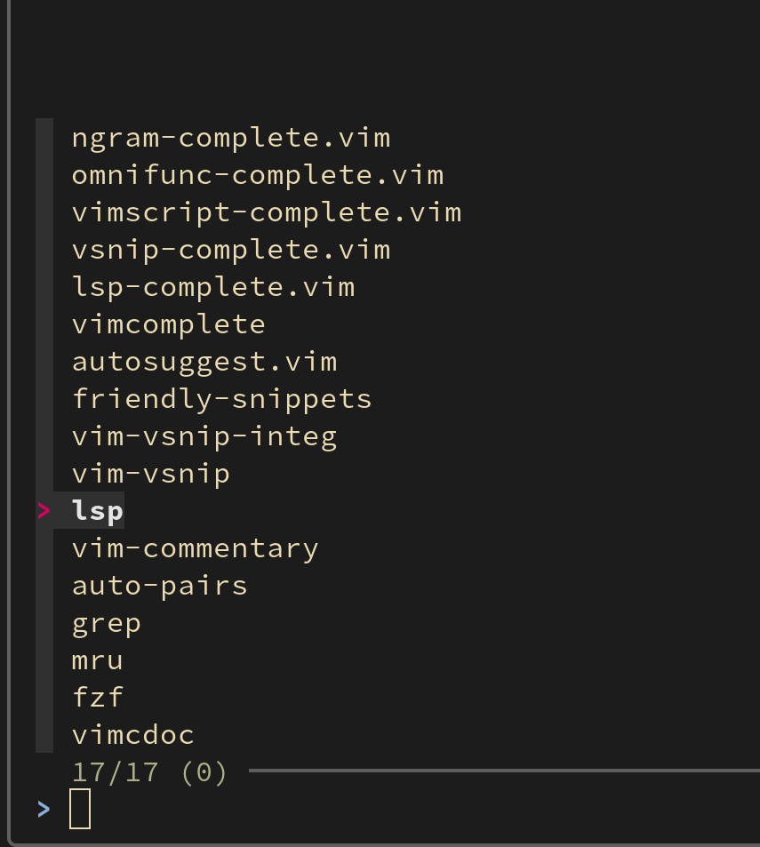

# vim-plug-config

Manage the configs for each vim-plugged plugin in a separate file.



## Requirements

-   [vim-plug](https://github.com/junegunn/vim-plug)

## What it does

-   Automatically load configs for each plugin.
-   Help you manage the config files of the plugins.

## Installation

```viml
Plug 'Song-Tianxiang/vim-plug-config'
```

You'd better add this as the first plugin in your plug list to prevent setting configs for other plugins after they are loaded.

Alternatively, you can load the configs on the VimEnter event:

```viml
g:plug_config_autoload = false
autocmd VimEnter * PlugLoadAll
```

## Commands

-   `PlugLoad <plug-name>`: Load the config of `<plug-name>`. Use `TAB` to help you complete.
-   `PlugLoadAll`: Load the configs of all plugged plugins. By default, it is executed when `vim-plug-config` is loaded.
-   `PlugConfig <plug-name>`: Edit the config of `<plug-name>`. Use `TAB` to help you complete.
-   `FZFPlugConfig`: FZF search `<plug-name>` to edit config file.

## Configs

Note: These variables shouldn't be set in the `plug-config` file of `vim-plug-config` itself. i.e. you need to set them in your `vimrc`.

### `g:plug_config_autoload`

-   Default: `true`
-   Whether to auto-load all configs at startup.

### `g:plug_config_dir`

-   Default: `~/.vim/plug-config`

### `g:plug_config_edit_command`

-   Default: `edit`
-   The command used to edit the config file. e.g. `edit`, `split`, `vsplit`, `tabnew`.

### `g:plug_config_fzf`

-   Default: `false`
-   Whether enable fzf integration `:FZFPlugConfig`. [FZF](https://github.com/junegunn/fzf) needed.

## Modifications

- **Vim9 Only:** This plugin currently supports Vim9, with all Lua and NeoVim-related content removed. If you are a NeoVim user, you might be interested in [vim-plug-config](https://github.com/ouuan/vim-plug-config) and [lazy.nvim](https://github.com/folke/lazy.nvim).
- **Different:** Add command completion to `PlugConfig` and `PlugLoad`, removed `PlugConfigEditUnderCuror`.

## Credits

This plugin is developed based on [vim-plug-config](https://github.com/ouuan/vim-plug-config), originally created by [Yufan You](https://github.com/ouuan).

