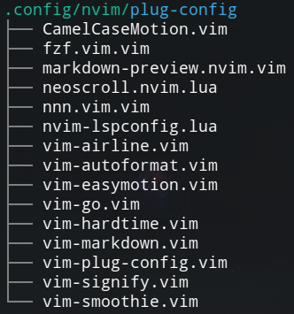

# vim-plug-config

Manage the configs for each vim-plugged plugin in a separate file.



## Requirements

-   [vim-plug](https://github.com/junegunn/vim-plug)

## What it does

-   Automatically load configs for each plugin.
-   Help you manage the config files of the plugins.
-   Supports both Vim Script and Lua config files.

## Installation

```viml
Plug 'Song-Tianxiang/vim-plug-config'
```

You'd better add this as the first plugin in your plug list to prevent setting configs for other plugins after they are loaded.

Alternatively, you can load the configs on the VimEnter event:

```viml
let g:plug_config_autoload = 0
autocmd VimEnter * PlugLoadAll
```

## Commands

-   `PlugLoad <plug-name>`: Load the config of `<plug-name>`. Use <TAB> to help you complete.
-   `PlugLoadAll`: Load the configs of all plugged plugins. By default, it is executed when `vim-plug-config` is loaded.
-   `PlugConfig <plug-name>`: Edit the config of `<plug-name>`. Use <TAB> to help you complete.

## Configs

Note: These variables shouldn't be set in the `plug-config` file of `vim-plug-config` itself. i.e. you need to set them in your `vimrc`.

### `let g:plug_config_autoload`

-   Default: `1`
-   Whether to auto-load all configs at startup.

### `let g:plug_config_dir`

-   Default: `stdpath("config") . "/plug-config"` (e.g. `~/.config/nvim/plug-config`)
-   Where the Vim Script config files are stored.

### `let g:plug_config_edit_command`

-   Default: `edit`
-   The command used to edit the config file. e.g. `edit`, `split`, `vsplit`.

## Modifications

This project has made several enhancements and modifications to the [vim-plug-config](https://github.com/ouuan/vim-plug-config) to meet specific requirements or add new features. Here are the key changes:

- **Vim Only:** This plugin currently supports Vim, with all Lua and NeoVim-related content removed. If you are a NeoVim user and are looking for versions or alternatives specifically designed for NeoVim, you might be interested in [lazy.nvim](https://github.com/folke/lazy.nvim)
- **Different:** Add command completion to `PlugConfigEdit` and `PlugConfigLoad`, removed `PlugConfigEditUnderCuror`.

Thanks to [Yufan You] for providing the original plugin, and these modifications are built upon their work.

## Credits

This plugin is developed based on [vim-plug-config](https://github.com/ouuan/vim-plug-config), originally created by [Yufan You](https://github.com/ouuan).

